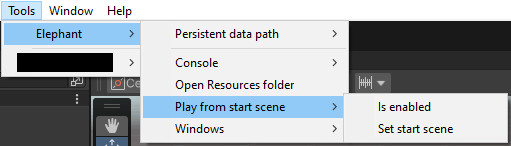
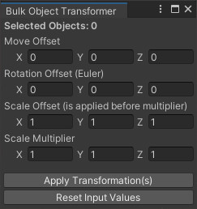
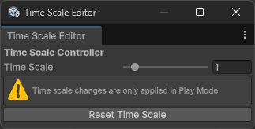
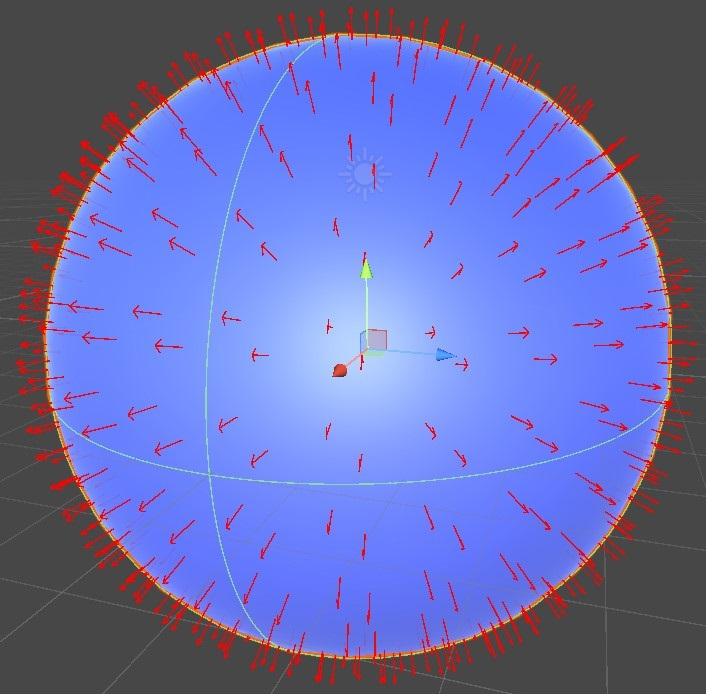
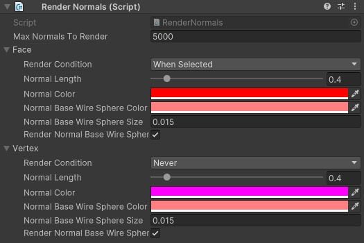
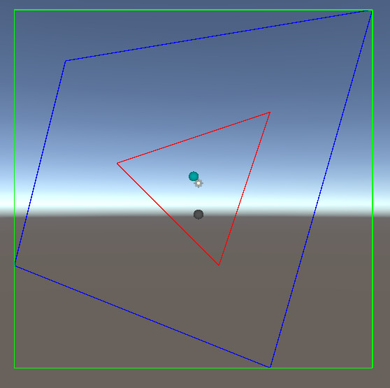
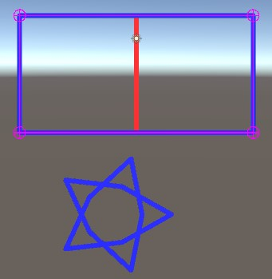
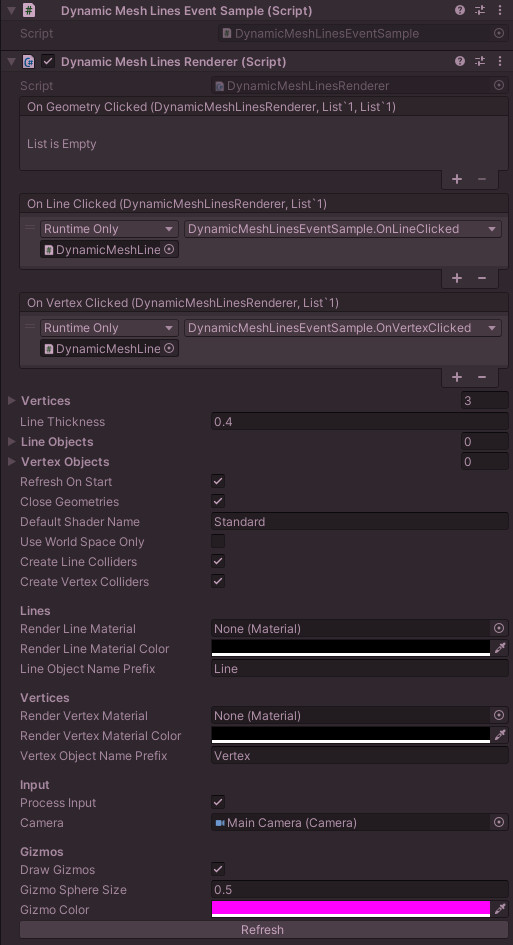
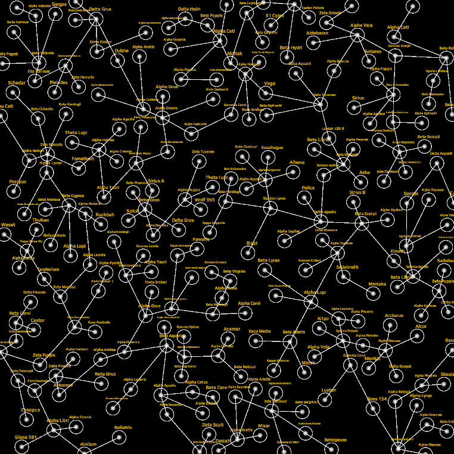
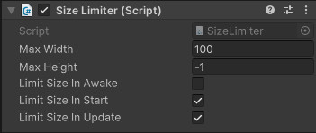

# Table of Contents

1. [About](#about)
2. [Installation](#installation)
3. [Coroutine Starter](#coroutinestarter)
4. [Menus and Windows](#menus-and-windows)
5. [Loggers](#loggers)
6. [Extensions](#extensions)
7. [Unity Objects](#unity-objects)
8. [Geo Systems](#geo-systems)
9. [Math](#math)
10. [Networks](#networks)
11. [Securities](#securities)
12. [String Operations](#string-operations)
13. [Spatial Algorithms](#spatial-algorithms)
14. [Pathfinding](#pathfinding)
15. [UGUI](#ugui)
16. [FAQ](#faq)
17. [Other](#other)
18. [For Developers](#for-developers)
19. [Version History](#version-history)

# About

Written for Unity Editor version **2022.3.7f1 (LTS)**. Note that most, if not all, earlier versions also seem to work but it's not recommend using this library in Unity Editor versions that are really old.

# Installation

Copy all Folders into your project. <u>Don't</u> put it in special Unity folders like "Editor" or "Resources".

If you use the DLL version instead then ensure that the DLL file is placed in the "Plugins" folder, which is a special Unity folder. If this folder does not exist then first create a new folder in your project root called "Plugins" and then add the DLL file into that folder.

The DLL "Elephant.UnityLibrary.Localizations.dll" is contains optional localization code, you don't need this DLL if you don't use my localization code.


# CoroutineStarter

Allows you to start coroutines from non-monobehaviour code and can optionally also manage and track coroutines because Unity does not support a CancellationToken. Supports an OnCompleted event, has categories and tags. Example screenshot:


## Example

```c#
private IEnumerator WaitMe(float seconds)
{
	yield return new WaitForSeconds(seconds);
	Debug.Log($"Done waiting for {seconds} seconds.");
}

private void SomeOptionalCallback()
{
	Debug.Log("Finished.");
}

private void Awake()
{
	CoroutineStarter.Instance.StartCoroutineManaged(WaitMe(2, SomeOptionalCallback), "Debug", "Example");
}

private void Start()
{
	CoroutineStarter.Instance.StopCoroutinesManaged("Debug"); // Stops all coroutines in the "Debug" main category.
	CoroutineStarter.Instance.StopCoroutinesManaged("Debug", "Example"); // Stops all coroutines in the "Debug" main-category that also are located in the "Example" sub-category.
}
```

## Methods, properties and functions

```c#
// Events.
public event EventHandler<CoroutineValue>? OnStartTrackingCoroutine;
public event EventHandler<CoroutineValue>? OnStopTrackingCoroutine;

// Methods and properties.
CoroutineStarter.UncategorizedValue // Used as a default value when no main- or sub-category is specified.
CoroutineStarter.Instance // Access the CoroutineStarter its singleton instance.    
CoroutineStarter.StopAllTrackedOnUnloadScene // If true, will stop and untrack all coroutiness when the scene is being unloaded. Defaults to false.
CoroutineStarter.MainCategoriesToStopOnUnloadScene // All main-categories to stop and untrack when the scene is being unloaded. Defaults to none.
CoroutineStarter.TotalTrackedCoroutinesStarted;
CoroutineStarter.TotalTrackedCoroutinesStopped;

// Public functions.
public virtual Coroutine StartCoroutineTracked(Func<IEnumerator> routine, string mainCategory = UncategorizedValue, string subCategory = UncategorizedValue, [CallerMemberName] string callerName = "", Action? onComplete = null, params string[] tags);

public virtual Coroutine StartCoroutineNamedTracked(Func<IEnumerator> routine, string? coroutineName = null, string mainCategory = UncategorizedValue, string subCategory = UncategorizedValue, bool stopExisting = true, [CallerMemberName] string callerName = "", Action? onComplete = null, params string[] tags);

public virtual bool StopTrackedCoroutine(string coroutineName);

public virtual bool StopTracking(string coroutineName);

public virtual int StopAllTrackedCoroutines();

public new void StopAllCoroutines();

public virtual List<string> StopTrackedCoroutines(string? mainCategory = null, string? subCategory = null, List<string>? tags = null);
```

# Menus and Windows

They are located under "Tools > Elephant".







# Loggers

## Example implementation of the non-static variant

```c#
public class PokemonLogger : ConsoleLogger
{
    public PokemonLogger()
    {
        // Optionally assign a tag to this logger.
        LogTag = "Pokemon";

#if !DEBUG
        // Example of setting a logging filter in release builds. This is optional.
        FilterLogType = LogType.Warning;
#endif
    }

    // Optionally override this method to determine when a specific logger should be allowed to log.
    public override bool IsLogTypeAllowed(LogType logType)
    {
        return base.IsLogTypeAllowed(logType) && <Whatever condition you want>;
    }
}

// Put this class onto a GameObject prefab and put that one into your special Unity's "Resources" folder.
public class LogManager : MonoBehaviour
{
	public static LogManager Instance = null!;

	public PokemonLogger PokemonLogger { get; } = new();

	/// <summary>
	/// Runs before a scene gets loaded and will only be executed once.
	/// </summary>
	[RuntimeInitializeOnLoadMethod(RuntimeInitializeLoadType.BeforeSceneLoad)]
	public static void Initialize()
	{
		PokemonLogger = new()
	}

	public override void Initialize()
	{
		Instance = this;

		// Allows all console log types globally.
		Debug.unityLogger.filterLogType = LogType.Log;

         // Allows console logging globally.
		Debug.unityLogger.logEnabled = true;
	}
}

// Now somewhere in your code:
private PokemonLogger _logger = null!;
private void Awake()
{
	_logger = LogManager.Instance.FfseLogger;
    // Note that double clicking this log in the Unity console should open the below line in your IDE as well.
	_logger.Log("A yellow mouse entered your code. Prepare for an epic battle!")
}
```

# Extensions

## Between

```c#
public static bool IsBetween<T>(this T value, T min, T max)	where T : IComparable<T>
public static bool IsBetweenII<T>(this T value, T min, T max) where T : IComparable<T>
public static bool IsBetweenEI<T>(this T value, T min, T max) where T : IComparable<T>
public static bool IsBetweenIE<T>(this T value, T min, T max) where T : IComparable<T>
public static bool IsBetweenEE<T>(this T value, T min, T max) where T : IComparable<T>
```

## Color

```c#
public static Color Alpha(this Color color, float alpha)
public static Color Alpha(this Color color, Color colorAlpha)
public static Color Darken(this Color color, float blendFactor)
public static Color Hue(this Color color, float hue)
public static Color Lighten(this Color color, float blendFactor)
public static Color Saturate(this Color color, float saturation)
```

## Enumerable

```c#
// Return random element(s).
public static IEnumerable<T> GetRandom<T>(this IEnumerable<T> source, int count);

// Return random element.
public static T GetRandom<T>(this IEnumerable<T> source);

// Shuffle the elements. Modifies the source.
public static IEnumerable<T> Shuffle<T>(this IEnumerable<T> source);

// Shuffle the elements using a seed. Modifies the source.
public static IEnumerable<T> Shuffle<T>(this IEnumerable<T> source, int seed)

// Determines if the source is empty.
public static bool IsEmpty<TSource>(this IEnumerable<TSource> source);

// Return true if ALL of values are contained in source.
// Returns true if values is empty.
public static bool ContainsAll<TSource>(this IEnumerable<TSource> source, IEnumerable<TSource> values);

// Return true if NONE of values are contained in source.
// Returns true if either source or values is empty.
public static bool ContainsNone<TSource>(this IEnumerable<TSource> source, IEnumerable<TSource> values);

// Determines if the <paramref name="source"/> is empty.
public static bool None<TSource>(this IEnumerable<TSource> source);

// Determines whether any element of a sequence does not satisfy a condition. This is the same as !source.Any(..).
public static bool None<TSource>(this IEnumerable<TSource> source, Func<TSource, bool> predicate);

// Return true if the first item of source equals itemToCompare.
public static bool IsFirst<TSource>(this IEnumerable<TSource> source, TSource itemToCompare);

// Return true if the last item of source equals itemToCompare.
public static bool IsLast<TSource>(this IEnumerable<TSource> source, TSource itemToCompare);

// Return true if EVERY item in source is unique or if it is empty or null.
public static bool AreAllItemsUnique<TSource>(this IEnumerable<TSource>? source);
```

## GameObject

```c#
// Sets GameObject to inactive and then destroys it.
public static void DeactivateAndDestroy(this GameObject gameObject, float t = 0f);

// Sets only the children of the GameObject to inactive and then destroys them.
public static void DeactivateAndDestroyAllChildren(this GameObject parent, float t = 0f);

// Destroys only the children of the GameObject.
public static void DestroyAllChildren(this GameObject parent, float t = 0f);

// Finds the first child GameObject by name.
public static GameObject? FirstChildByName(this GameObject parent, string childName, bool findRecursive = false, bool isCaseSensitive = true, bool includeInactive = true);
```

## General

```c#
// Returns the orthographic camera bounds in world space.
public static Bounds OrthographicBounds(this Camera camera);

// Searches recursively for a child transform with the specified name within the descendants of the given parent transform.
public static Transform FindRecursively(this Transform parent, string name);
```

## List

```c#
// Shuffle the elements. Modifies the source list.
public static void Shuffle<T>(this IList<T> list);

// Add itemToAdd only if it doesn't already exist in list.
public static void AddUnique<T>(this List<T> list, T itemToAdd);

// Add items but only those that don't already exist in list.
public static void AddRangeUnique<T>(this List<T> list, IEnumerable<T> items);

// Add the item to the source list unless it already exists in that list in which case it will remove it instead. Modifies the source list.
public static IList<TSource> AddOrRemoveIfExists<TSource>(this IList<TSource> list, TSource item);

// Add the item to the <paramref name="list"/> unless it already exists in that list in which case it will remove it instead.
// If <paramref name="list"/> is null then nothing happens. Modifies the source list.
public static IList<TSource>? AddOrRemoveIfExistsNullable<TSource>(this IList<TSource>? list, TSource item);
```

## Rect

```c#
// Calculates the combined Axis-Aligned Bounding Box (AABB) from a collection
// of Rect objects. This method determines the minimum and maximum extents of
// the collection and returns a Rect that encompasses all the Rect objects within
// it. If the collection is null or empty, a Rect with zero position and size is
// returned.
public static Rect Combine(this IEnumerable<Rect>? rects);
```

## Transform

```c#
// Sets GameObject of this Transform to inactive and then destroys it.
public static void DeactivateAndDestroy(this Transform transform, float t = 0f);

// Sets only the children of the GameObject to inactive and then destroys them.
public static void DeactivateAndDestroyAllChildren(this Transform parent, float t = 0f);

// Destroys only the children of the GameObject.
public static void DestroyAllChildren(this Transform parent, float t = 0f);

// Finds the first child Transform by name.
public static Transform? FirstChildByName(this Transform parent, string childName, bool findRecursive = false, bool isCaseSensitive = true, bool includeInactive = true);
```

## Vector

```c#
// Convert 3D vector3 into the correct 2D Vector2. The Vector3.y value is discarded.
public static Vector2 To2d(this Vector3 vector3);

// Convert 2D vector2 into the correct 3D Vector3.
// The Vector3.y value is set to 0f and the vector2.y value is set to the Vector3.z value.
public static Vector3 To3d(this Vector2 vector2);

// Returns the normalized direction from one vector to another.
public static Vector2 DirectionTo(this Vector2 from, Vector2 to);

// Returns the normalized direction from one vector to another.
public static Vector3 DirectionTo(this Vector3 from, Vector3 to);

// Conversions below map each component directly: x to x, y to y, z to z, and w to w, using 0f for any components that do not exist.
public static Vector2 ToVector2(this Vector3 vector3);
public static Vector2 ToVector2(this Vector4 vector4);
public static Vector3 ToVector3(this Vector2 vector2, float z = 0f);
public static Vector3 ToVector3(this Vector4 vector4);
public static Vector4 ToVector4(this Vector2 vector2, float z = 0f, float w = 0f);
public static Vector4 ToVector4(this Vector3 vector3, float w = 0f);
```


## Wrapping

```c#
// Keeps the value between min and max. If it exceeds max then it'll start over at min again (keeping the overflow value).
public static int Wrap(this int value, int max, int min = 0);

// Keeps the value between 1 and max. If it exceeds max then it'll start over at min again (keeping the overflow value).
public static int WrapOne(this int value, int max);

// Keeps the value between min and max. If it exceeds max then it'll start over at min again (keeping the overflow value).
public static int? Wrap(this int? value, int max, int min = 0);

// Keeps the value between 1 and max. If it exceeds max then it'll start over at min again (keeping the overflow value).
public static int? WrapOne(this int? value, int max);
```


# Unity Objects

## Camera

- FlyCam
- ResolutionIndependentCamera
- ScaleCameraWithScreenResolution

## Core

- Singleton
- SingletonNonPersistent

## Debugging (only works if you don't use the DLL version)

- RenderNormals (for testing normals, shadows, etc.)
  - RenderNormalsData




## Editor

- AutoOpenAndFocusConsole (Only works if you use the non-DLL version).

## Various

And various others but I'm too lazy to document those right now.


# Geo Systems

Is able to render complex (Multi)-Polygons.



<p float="left">
  
  
</p>

## Geometry object Classes

- **GeometryVertex**
  - Is just a coordinate.
- **GeometryLine**
  - Contains 2 vertices.
- **Ring**
  - Contains 0 or more lines.
- **Polygon**
  - Contains 0 or 1 exterior ring and 0 or more interior rings.
- **MultiPolygon**
  - Contains zero or more polygons.

## Geometry renderers

- **DynamicMeshLinesRenderer**
  - **DynamicMeshLinesRendererEditor** (editor only)
- **GeometryFillRenderer**
- **MultiPolygonRenderer**

## Helpers

### WktPolygonParser

```c#
// Parse a WKT string representing either a POLYGON or a MULTIPOLYGON.
public static List<List<List<Vector2>>> ParseWkt(string? wkt);

// Splits a multi-polygon string into polygon strings.
public static List<string> SplitMultiPolygonIntoPolygons(string multiPolygonContent)

// Returns true if the geometry is truly a multi-polygon (instead of a regular polygon).
public static bool IsMultiPolygon(List<List<List<Vector2>>> geometry)

// Convert geometry into either a POLYGON or MULTIPOLYGON WKT string.
public static string ToWktString(List<List<List<Vector2>>> geometry, bool forceAsMultiPolygon = false, string defaultValue = EmptyMultiPolygon)
```

### WktPolygonUtils

```c#
/// Calculate bounds of a multi-polygon its points.
public static (Vector2 MinBounds, Vector2 MaxBounds) PointsToBounds(List<List<List<Vector2>>> geometry);

// Calculate center vector from min- and max bounds.
public static Vector2 CenterFromBounds(Vector2 minBounds, Vector2 maxBounds);

// Rotates a complex geometry consisting of multiple polygons.
public static List<List<List<Vector2>>> RotatePoints(List<List<List<Vector2>>> geometry, float degrees, Vector2 origin)

// Rotates a geometry represented by a WKT (Well-Known Text) string.
public static List<List<List<Vector2>>> RotateWktStringAsPoints(string wktString, float degrees, Vector2 origin);

// Rotates a geometry represented by a WKT string and returns the result as a WKT string.
public static string RotateWktString(string wktString, float degrees, Vector2 origin)

// Normalizes the degrees to be within 0 to 359.99999.
public static float NormalizeDegrees(float degrees);

// Translate (=move its position) the wktString.
public static string Translate(string wktString, Vector2 translation);

// Translate (=move its position) the geometry.
public static List<List<List<Vector2>>> Translate(List<List<List<Vector2>>> geometry, Vector2 translation);

// Calculates the area of a polygonal ring using the Shoelace formula.
// WARNING: This method is VERY inaccurate! A better implementation is perhaps required.
public static float CalculateRingArea(List<Vector2> ring);

// Calculates the area of a multi-polygon using the Shoelace formula.
// WARNING: This method is VERY inaccurate! A better implementation is perhaps required.
public static float CalculateSurfaceArea(List<List<List<Vector2>>> multipolygon);
```

# Localization

- Use namespace **Elephant.UnityLibrary.Localizations**. Add the **LocalizationManager** to a **GameObject** in your startup scene.
- The LocalizationManager will load the localizations before the scene even loads. Feel free to use it in your **Awake()** methods.
- Your localization CSV files should be put in the **Resources** folder. Example: **Assets/Resources/Localizations/Localization_en.csv**

## Example usage

```c#
// Set language to English. By default the languageKey must match the suffix of your CSV file.
// The example below by default matches file: "Assets/Resources/Localizations/Localization_en.csv".
LocalizationManager.Instance.SetLanguage("en");

// Log the current language key.
Debug.Log(LocalizationManager.Instance.CurrentLanguageKey);

// Translate the "music" keyword.
string musicText = LocalizationManager.Instance.Localize("music");

// Optionally subscribe to OnLanguageChanged.
LocalizationManager.Instance.OnLanguageChanged += RefreshLocalization;
private void RefreshLocalization()
{
	// Put your localization refresh work here.
}
```

## CSV content example

Note that the CSV header row is required.

```
Key,Translation
musicVolume,Musiklautstärke
soundVolume,Soundlautstärke
```

## Use different directories and/or filenames

You may inherit from **LocalizationManager** and override **BuildDirectoriesAndFilename()**.

```c#
protected override string BuildDirectoriesAndFilename(string languageKey)
{
	// return $"Localizations/Localization_{languageKey}"; // Default implementation.
	// Your implementation here.
	// The return value must NOT include the "Resources/" folder nor anything before that.
	// The return value must NOT include the file extension.
}

// You may also override the default language key (defaults to "en" by default).
protected override string DefaultLanguageKey() => "your_language_key_here";
```

# Math

```c#
RectGeometry.CalcMaxSquaresInRect(Rect containerRect, Rect squareSize)
```

# Networks

```c#
NetworkStatus.TestOverrideInternetConnectionToUnavailable
NetworkStatus.HasReachableInternetConnection()
```

# Securities

`NumericObfuscator` class that can obfuscate and deobfuscate `decimals`, `doubles`, `floats`, `ints`, `longs` which provides basic protection against memory hacking.

# String Operations

```c#
StringOperations.CapitalizeFirstChar(string stringToCapitalize)
StringOperations.CapitalizeFirstCharNullable(string? stringToCapitalize)
StringOperations.ConvertToBool(string? value) // Accepts: "true", "True", "false", "False", 1, 0, "", <null>
StringOperations.EncloseByIfNotAlready(string value, char encloser)
StringOperations.Join(char separatorChar, params string?[] stringsToCombine)
StringOperations.JoinWithLeading(char separatorChar, params string?[] stringsToCombine)
StringOperations.JoinWithTrailing(char separatorChar, params string?[] stringsToCombine)
StringOperations.JoinWithLeadingAndTrailing(char separatorChar, params string?[] stringsToCombine)
StringOperations.RemoveSubstringFromString(string source, string substringToRemove)
StringOperations.RemoveSubstringsFromString(string source, IEnumerable<string> substringsToRemove)
StringOperations.SplitByNewLine(string value, StringSplitOptions stringSplitOptions = StringSplitOptions.None)
StringOperations.ToTitleCase(string stringToTitleCase)
StringOperations.ToTitleCaseNullable(string? stringToTitleCase)
```

# Spatial Algorithms

There are five well-known spatial 2D algorithms: Bounding Volume Hierarchies (BVH), Delaunay Triangulation, Quadtree, Spatial Hashing, and Sweep and Prune.

| Algorithm                             | Use Case                                          | How It Works                                                 | Benefits                                                     | Drawbacks                                                  |
| ------------------------------------- | ------------------------------------------------- | ------------------------------------------------------------ | ------------------------------------------------------------ | ---------------------------------------------------------- |
| **Bounding Volume Hierarchies (BVH)** | Managing hierarchical bounds of objects.          | Objects are grouped into bounding boxes, forming a tree structure. Spatial queries are answered by testing for intersections with bounding boxes. | Good for optimizing collision detection. Fewer object checks due to hierarchy. | Tree may need to be rebalanced as objects move.            |
| **Delaunay Triangulation**            | Optimizing networks or graphs in 2D.              | Creates a mesh of triangles between points in a 2D plane, ensuring no point is inside the circumcircle of any triangle. | Useful for pathfinding, terrain generation, and minimizing overlap in connections. | More complex to implement and maintain than other methods. |
| **Quadtree**                          | Organizing objects into hierarchical grids in 2D. | The 2D space is recursively subdivided into four quadrants. Each node can have up to four children. If a region has too many objects, it's subdivided. | Efficient for collision detection, range queries, and nearest-neighbor searches. Reduces need to check every object. | Performance can degrade if objects are clustered.          |
| **Spatial Hashing**                   | Managing many objects in a 2D space.              | A 2D grid is created, hashing each object into a specific cell based on its spatial location. Objects in the same or neighboring cells are checked for interactions. | Fast lookup for nearby objects. More memory efficient than a quadtree in certain scenarios. | Requires tuning of the grid size based on distribution.    |
| **Sweep and Prune**                   | Dynamic environments for collision detection.     | Objects are sorted along a single axis, overlaps between objects are computed, then checked on a second axis. | Efficient for detecting collisions between moving objects.   | Less efficient in highly clustered environments.           |


## Spatial Hashing

```c#
using System.Collections.Generic;
using UnityEngine;

public class StarSpatialObject : SpatialObject2d
{
	public Star Star; // Your Star class or whatever you need here.

	public StarSpatialObject(Vector2 position, float radius, Star star)
		: base(position, radius)
	{
		Star = star;
	}
}

public class StarManager
{
    public void Foo()
    {
        // Create an instance of the spatial hash with a specified cell size.
        SpatialHash2D spatialHash2D = new SpatialHash2D(100f);

        // Create some stars.
        Star starA = new Star(/* initialize parameters. */);
        Star starB = new Star(/* initialize parameters. */);
        Star starC = new Star(/* initialize parameters. */);

        // Create spatial objects for each star.
        StarSpatialObject starSpatialObjectA = new StarSpatialObject(starA.Position, Star.StarSize / 2f, starA);
        StarSpatialObject starSpatialObjectB = new StarSpatialObject(starB.Position, Star.StarSize / 2f, starB);
        StarSpatialObject starSpatialObjectC = new StarSpatialObject(starC.Position, Star.StarSize / 2f, starC);

        // Add stars to the spatial hash.
        spatialHash2D.AddObject(starSpatialObjectA);
        spatialHash2D.AddObject(starSpatialObjectB);
        spatialHash2D.AddObject(starSpatialObjectC);

        // Example: Find nearby stars for starA.
        List<StarSpatialObject> nearbyStars = spatialHash2D.FindObjectsInNeighbors(starSpatialObjectA.GridPos, true);
        
		// Example: Check if the line between starA and starC overlaps with any other spatial objects.
		if (spatialHash2D.LineOverlapsObjects(starA.Position, starC.Position, Star.StarSize / 2f, new List<ISpatialObject2d> { starSpatialLookup[starA], starSpatialLookup[starC] }))
		{
		    // Do something.
		}
    }
}
```
### Example result
A quickly put together example of a star map generated (it generates very fast) entirely with this spatial hashing, featuring randomly placed stars, connections, and checks to ensure that neither stars nor their connections overlap (though overlapping connections are acceptable in this example):



# Pathfinding

## A-star (A*) 2D

```c#
private List<List<GridCell>> _grid = new(); // Your GridCell class must implement IGridCell2D and the _grid must be filled.
private const int GridWidth = 50;
private const int GridHeight = 50;
private Vector2Int _playerIndex = new Vector2Int(1, 1);

private void TryToMovePlayer(Vector2Int destinationIndex)
{
	IAStar2D pathfinder = new AStar2D();
	List<Vector2Int> path = pathfinder.FindPath(_grid, GridWidth, GridHeight, _playerIndex, destinationIndex);
	if (path.Any())
	{
	    // Do something with the path. Example:
	    MovePlayerAlongPath(path);
	}
    else
    {
        Debug.Log($"No path from {_currentPlayIndex} to {destinationIndex} found.");
    }
}
```

# UGUI

Unity's uGUI is the built-in system for creating and managing user interfaces in Unity games and is the older alternative to the UI Toolkit and is able to use prefabs and custom scripts.

## Size Limiter



# FAQ

### Q: I don't see any logs in the console.

### A: Ensure that the following settings have been set somewhere prior to logging:

```c#
// Anywhere prior to logging:
// Allows all console log types globally.
Debug.unityLogger.filterLogType = LogType.Log;
// Allows console logging globally.
Debug.unityLogger.logEnabled = true;
    
// IConsoleLogger (or the static version if you use it):
// Allows all log types.
FilterLogType = LogType.Log;
// Allows logging.
LogEnabled = true;
```

# Other

- **Billboard**: A MonoBehaviour that always faces the assigned camera and that is unlike the `BillboardRenderer`, compatible with a `SpriteRenderer`.
- **CooldownTimer**: Manages a cooldown timer that can be updated, reset, and checked for readiness.
- **DeveloperNotes**: A MonoBehaviour that you can add that contains developer notes. Will self-destroy outside of Unity Editor.
- **FloatRangeValue**: A serializable float with a min, max, value and percentage.
- **IntRangeValue**: A serializable int with a min, max, value and percentage.
- **Mail**: An e-mail wrapper compatible with PC, Android and iOS.
- **PrefabInstantiator**: Contains alternative ways to instantiate prefabs.
- **PrefabReference**: A simple MonoBehaviour with a prefab reference.
- **ScenePreloader**: Preloads scenes to reduce user loading times.
- **UndoRedo**: A complete generic undo and redo manager.

# For Developers

If you need updated versions of the **UnityEditor.dll** and **UnityEngine.dll** files for when editing this project directly, they can be found in the following locations:

- Windows:<Unity Installation Path>\Editor\Data\Managed\
  - Example: C:\Program Files\Unity\Hub\Editor\2022.3.7f1\Editor\Data\Managed\UnityEditor.dll

- MacOS: /Applications/Unity/Unity.app/Contents/Managed/

# Version History

There isn't any. I currently don't keep a version history for this project.
