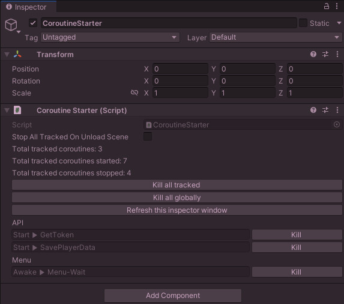

# Unity library

Written for Unity Editor version **2022.3.7f1 (LTS)**. Note that most, if not all, earlier versions also seem to work but it's not recommend using this library in Unity Editor versions that are really old.

# Installation

Copy all Folders into your project. <u>Don't</u> put it in special Unity folders like "Editor" or "Resources".


# CoroutineStarter

Allows you to start coroutines from non-monobehaviour code and can optionally also manage and track coroutines because Unity does not support a CancellationToken. Supports an OnCompleted event, has categories and tags. Example screenshot:



## Example

```c#
private IEnumerator WaitMe(float seconds)
{
	yield return new WaitForSeconds(seconds);
	Debug.Log($"Done waiting for {seconds} seconds.");
}

private void SomeOptionalCallback()
{
	Debug.Log("Finished.");
}

private void Awake()
{
	CoroutineStarter.Instance.StartCoroutineManaged(WaitMe(2, SomeOptionalCallback), "Debug", "Example");
}

private void Start()
{
	CoroutineStarter.Instance.StopCoroutinesManaged("Debug"); // Stops all coroutines in the "Debug" main category.
	CoroutineStarter.Instance.StopCoroutinesManaged("Debug", "Example"); // Stops all coroutines in the "Debug" main-category that also are located in the "Example" sub-category.
}
```

## Methods, properties and functions

```c#
// Events.
public event EventHandler<CoroutineValue>? OnStartTrackingCoroutine;
public event EventHandler<CoroutineValue>? OnStopTrackingCoroutine;

// Methods and properties.
CoroutineStarter.UncategorizedValue // Used as a default value when no main- or sub-category is specified.
CoroutineStarter.Instance // Access the CoroutineStarter its singleton instance.    
CoroutineStarter.StopAllTrackedOnUnloadScene // If true, will stop and untrack all coroutiness when the scene is being unloaded. Defaults to false.
CoroutineStarter.MainCategoriesToStopOnUnloadScene // All main-categories to stop and untrack when the scene is being unloaded. Defaults to none.
CoroutineStarter.TotalTrackedCoroutinesStarted;
CoroutineStarter.TotalTrackedCoroutinesStopped;

// Public functions.
public virtual Coroutine StartCoroutineTracked(Func<IEnumerator> routine, string mainCategory = UncategorizedValue, string subCategory = UncategorizedValue, [CallerMemberName] string callerName = "", Action? onComplete = null, params string[] tags);

public virtual Coroutine StartCoroutineNamedTracked(Func<IEnumerator> routine, string? coroutineName = null, string mainCategory = UncategorizedValue, string subCategory = UncategorizedValue, bool stopExisting = true, [CallerMemberName] string callerName = "", Action? onComplete = null, params string[] tags);

public virtual bool StopTrackedCoroutine(string coroutineName);

public virtual bool StopTracking(string coroutineName);

public virtual int StopAllTrackedCoroutines();

public new void StopAllCoroutines();

public virtual List<string> StopTrackedCoroutines(string? mainCategory = null, string? subCategory = null, List<string>? tags = null);
```

# Loggers

## Example implementation of the non-static variant

```c#
public class PokemonLogger : ConsoleLogger
{
    public PokemonLogger()
    {
        // Optionally assign a tag to this logger.
        LogTag = "Pokemon";

#if !DEBUG
        // Example of setting a logging filter in release builds. This is optional.
        FilterLogType = LogType.Warning;
#endif
    }

    // Optionally override this method to determine when a specific logger should be allowed to log.
    public override bool IsLogTypeAllowed(LogType logType)
    {
        return base.IsLogTypeAllowed(logType) && <Whatever condition you want>;
    }
}

// Put this class onto a GameObject prefab and put that one into your special Unity's "Resources" folder.
public class LogManager : MonoBehaviour
{
	public static LogManager Instance = null!;

	public PokemonLogger PokemonLogger { get; } = new();

	/// <summary>
	/// Runs before a scene gets loaded and will only be executed once.
	/// </summary>
	[RuntimeInitializeOnLoadMethod(RuntimeInitializeLoadType.BeforeSceneLoad)]
	public static void Initialize()
	{
		PokemonLogger = new()
	}

	public override void Initialize()
	{
		Instance = this;

		// Allows all console log types globally.
		Debug.unityLogger.filterLogType = LogType.Log;

         // Allows console logging globally.
		Debug.unityLogger.logEnabled = true;
	}
}

// Now somewhere in your code:
private PokemonLogger _logger = null!;
private void Awake()
{
	_logger = LogManager.Instance.FfseLogger;
    // Note that double clicking this log in the Unity console should open the below line in your IDE as well.
	_logger.Log("A yellow mouse entered your code. Prepare for an epic battle!")
}
```


## FAQ

### Q: I don't see any logs in the console.

### A: Ensure that the following settings have been set somewhere prior to logging:

```c#
// Anywhere prior to logging:
// Allows all console log types globally.
Debug.unityLogger.filterLogType = LogType.Log;
// Allows console logging globally.
Debug.unityLogger.logEnabled = true;
    
// IConsoleLogger (or the static version if you use it):
// Allows all log types.
FilterLogType = LogType.Log;
// Allows logging.
LogEnabled = true;
```

# For developers whom want to edit this project directly

If you need updated versions of the **UnityEditor.dll** and **UnityEngine.dll** files for when editing this project directly, they can be found in the following locations:

- Windows:<Unity Installation Path>\Editor\Data\Managed\
  - Example: C:\Program Files\Unity\Hub\Editor\2022.3.7f1\Editor\Data\Managed\UnityEditor.dll

- MacOS: /Applications/Unity/Unity.app/Contents/Managed/

# Version history

There isn't any. I don't keep a version history for this project.
